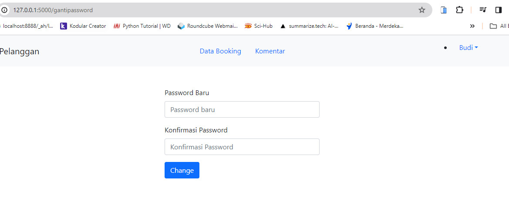

**\# CS50**

\- That is our final assignment to complete the intensive introductory course to the intellectual endeavors of computer science and the art of CS50 programming.

\- a web-based application using HTML, CSS, JavaScript, Python, and SQL

**\# Title Project "Hotel Taman Sari"**

\- The Taman Sari Hotel website displays data on room types, hotel facilities and hotel addresses. On the main page, visitors can see room types, hotel facilities and also prices for each room type and also book rooms.

\- In the admin menu, the admin can  view and change the status of the order who books the room, can view user data

\- Before entering the admin menu, users must log in first

\- If the user doesn't have an account, they must register first

**\## In making this application using software:**

&nbsp;    1.Visual Studio Code

&nbsp;    2.Python 3.12.1

&nbsp;    3.MySQL Version 10.4.25-MariaDB in XAMPP Version 8.1.10

&nbsp;    4.Flask==3.0.2

&nbsp;    5.Boostrap v5.1.3

&nbsp;    6.CSS

&nbsp;    7.HTML

&nbsp;    8.Javascript

**\## Features**

\- Login Page

\- Registration Page

\- Admin

&nbsp;   - Can view customer booking data

&nbsp;   - Can change booking data and booking status

&nbsp;   - Can view user data

&nbsp;   - Can change user data except email and password

&nbsp;   - Can view room data

&nbsp;   - Can input room data and upload room image

&nbsp;   - Can change and delete room data

\- Customer

&nbsp;   - Can input room booking

&nbsp;   - Can see booking data

&nbsp;   - Can change booking data

&nbsp;   - Can input comments

**\# Pictures**

Home
- 

User
- Login
- Registrasi
- Change Password

User :admin
-	Users Data
-	Rooms Data
-	Customers Data

-	Users Data

-	Rooms Data

-	Customers Data

User : Pelanggan
-	Bookings Data
-	Comments

-	Bookings Data

-	Comments

## Documentation

[Video](https://www.youtube.com/watch?v=xz8uAfh2SGI)